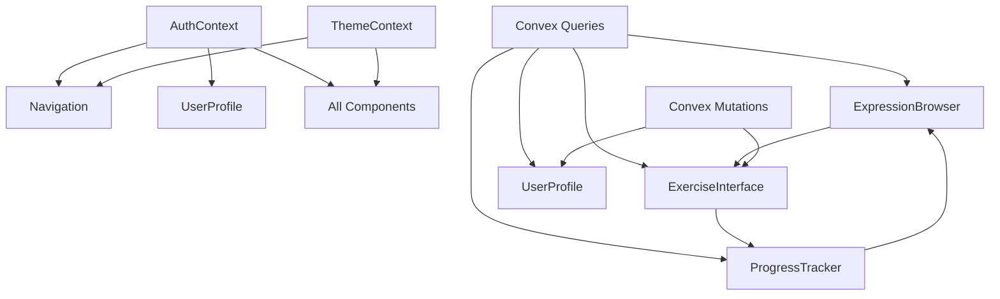

# **Phraser Language Learning App - Brownfield Enhancement Architecture**

## **Introduction**

This document outlines the architectural approach for enhancing Phraser with comprehensive frontend components for expression browsing, interactive exercise interface, progress tracking, and navigation system. Its primary goal is to serve as the guiding architectural blueprint for AI-driven development of new features while ensuring seamless integration with the existing system.

**Relationship to Existing Architecture:**
This document supplements existing project architecture by defining how new components will integrate with current systems. Where conflicts arise between new and existing patterns, this document provides guidance on maintaining consistency while implementing enhancements.

## **Existing Project Analysis**

### **Current Project State**

- **Primary Purpose:** Language learning platform with German expressions, interactive exercises, and AI-powered scoring
- **Current Tech Stack:** React 19 + TypeScript + Tailwind CSS + Vite + Convex (serverless database)
- **Architecture Style:** Full-stack React application with Convex backend and React Context state management
- **Deployment Method:** Convex cloud hosting with Vite development server

### **Available Documentation**

- ✅ Brownfield Architecture Document (`docs/brownfield-architecture.md`)
- ✅ Product Requirements Document (`docs/prd.md`)
- ✅ UI/UX Specification (`docs/front-end-spec.md`)
- ✅ Database Schema (`convex/schema.ts`)
- ✅ Authentication System (`convex/auth.ts`)

### **Identified Constraints**

- Must maintain existing authentication flow and user session management
- Must follow existing Tailwind CSS styling patterns and theme compatibility
- Must integrate with existing Convex React hooks patterns
- Must preserve existing user data structure without schema changes
- Must maintain performance characteristics (loading times, responsiveness)

### **Change Log**

| Change               | Date       | Version | Description                       | Author            |
| -------------------- | ---------- | ------- | --------------------------------- | ----------------- |
| Initial Architecture | 2024-12-19 | 1.0     | Frontend enhancement architecture | BMad Orchestrator |

## **Enhancement Scope and Integration Strategy**

### **Enhancement Overview**

**Enhancement Type:** UI/UX Overhaul with New Feature Addition
**Scope:** Comprehensive frontend components for language learning functionality
**Integration Impact:** Significant Impact - substantial existing code changes with new architectural patterns

### **Integration Approach**

**Code Integration Strategy:** Extend existing React component patterns with new components following established Context API and Convex hooks patterns

**Database Integration:** Leverage existing Convex schema without modifications, using existing tables (expressions, exercises, userProgress, exerciseAttempts)

**API Integration:** Create new Convex functions following existing patterns in `convex/auth.ts` with proper error handling and return types

**UI Integration:** Extend existing Tailwind CSS design system with new components maintaining color scheme, typography, and spacing patterns

### **Compatibility Requirements**

- **Existing API Compatibility:** All new Convex functions must integrate with existing authentication system and user data structure
- **Database Schema Compatibility:** New features must use existing database schema without requiring schema changes
- **UI/UX Consistency:** All new components must follow existing design patterns, color schemes, and interaction models
- **Performance Impact:** Must maintain existing performance characteristics and not exceed current memory usage by more than 20%

## **Tech Stack Alignment**

### **Existing Technology Stack**

| Category         | Current Technology | Version        | Usage in Enhancement  | Notes                            |
| ---------------- | ------------------ | -------------- | --------------------- | -------------------------------- |
| Frontend Runtime | React              | 19.0.0         | All new components    | Latest React with hooks          |
| Build Tool       | Vite               | 6.2.0          | Development and build | Fast development server          |
| Styling          | Tailwind CSS       | 4.0.14         | All new components    | Utility-first CSS framework      |
| Language         | TypeScript         | 5.7.2          | All new code          | Type safety and IntelliSense     |
| Backend          | Convex             | 1.23.0         | New API functions     | Serverless database + functions  |
| State Management | React Context      | -              | Auth and theme        | Extend existing patterns         |
| Package Manager  | npm                | -              | Dependencies          | Standard Node.js package manager |
| Development      | ESLint + Prettier  | 9.21.0 + 3.5.3 | Code quality          | Follow existing standards        |

### **New Technology Additions**

| Technology   | Version | Purpose                | Rationale                   | Integration Method                |
| ------------ | ------- | ---------------------- | --------------------------- | --------------------------------- |
| React Router | 6.x     | Client-side routing    | Navigation between sections | Integrate with existing App.tsx   |
| React Query  | 5.x     | Advanced data fetching | Optimize Convex queries     | Extend existing useQuery patterns |

## **Data Models and Schema Changes**

### **New Data Models**

#### **Expression Browser State**

**Purpose:** Manage expression browsing, filtering, and search state
**Integration:** Extends existing expressions table queries with client-side state management

**Key Attributes:**

- `filters`: Object - Category, difficulty, search query filters
- `pagination`: Object - Current page, items per page, total count
- `sortBy`: String - Sort field and direction
- `selectedExpression`: Object - Currently selected expression for detail view

**Relationships:**

- **With Existing:** Queries `expressions` table, integrates with `userProgress`
- **With New:** Feeds into `ExerciseInterface` component

#### **Exercise Session State**

**Purpose:** Manage active exercise session and user interactions
**Integration:** Extends existing exercises table with real-time session management

**Key Attributes:**

- `currentExercise`: Object - Active exercise data and context
- `userAnswer`: String - Current user input
- `sessionStartTime`: Number - Timestamp for performance tracking
- `attemptHistory`: Array - Previous attempts in current session

**Relationships:**

- **With Existing:** Queries `exercises` table, updates `exerciseAttempts`
- **With New:** Integrates with `ProgressTracker` for real-time updates

#### **Progress Analytics State**

**Purpose:** Manage progress tracking and statistics calculations
**Integration:** Aggregates data from existing `userProgress` and `exerciseAttempts` tables

**Key Attributes:**

- `progressSummary`: Object - Aggregated progress metrics
- `learningHistory`: Array - Recent learning activities
- `masteryLevels`: Object - Per-expression mastery tracking
- `performanceTrends`: Object - Time-based performance analytics

**Relationships:**

- **With Existing:** Queries `userProgress`, `exerciseAttempts`, `expressions`
- **With New:** Provides data for `ProgressTracker` component

### **Schema Integration Strategy**

**Database Changes Required:**

- **New Tables:** None required - using existing schema
- **Modified Tables:** None required - existing schema supports all features
- **New Indexes:** None required - existing indexes sufficient
- **Migration Strategy:** No migration required - enhancement uses existing schema

**Backward Compatibility:**

- All existing user data and functionality preserved
- Existing authentication and user management unchanged
- Current API endpoints remain functional
- Existing components continue to work without modification

## **Component Architecture**

### **New Components**

#### **Navigation Component**

**Responsibility:** Provide consistent navigation throughout the application with routing and user account controls
**Integration Points:** Integrates with existing `App.tsx`, `AuthContext`, and `ThemeContext`

**Key Interfaces:**

- `useAuth()` - Access user authentication state
- `useTheme()` - Access theme state for styling
- React Router navigation hooks
- Convex query hooks for user data

**File Location:** `src/components/Navigation.tsx`

#### **Expression Browser Component**

**Responsibility:** Browse, search, and filter German expressions with pagination and detail views
**Integration Points:** Queries existing `expressions` table, integrates with `ExerciseInterface`

**Key Interfaces:**

- `useQuery(api.expressions.getExpressions)` - Fetch expressions with filters
- `useQuery(api.expressions.getCategories)` - Get available categories
- `useQuery(api.expressions.getExpressionsByDifficulty)` - Filter by difficulty
- State management for filters, pagination, and selection

**File Location:** `src/components/ExpressionBrowser.tsx`

#### **Exercise Interface Component**

**Responsibility:** Provide interactive exercise practice with AI scoring and immediate feedback
**Integration Points:** Uses existing `exercises` table, updates `exerciseAttempts`, integrates with `ProgressTracker`

**Key Interfaces:**

- `useQuery(api.exercises.getExercisesForExpression)` - Load exercises for expression
- `useMutation(api.exercises.submitExerciseAttempt)` - Submit user answers
- `useQuery(api.progress.getUserProgress)` - Get user progress for expression
- State management for exercise session and user interactions

**File Location:** `src/components/ExerciseInterface.tsx`

#### **Progress Tracker Component**

**Responsibility:** Display comprehensive progress statistics, learning history, and performance analytics
**Integration Points:** Aggregates data from `userProgress`, `exerciseAttempts`, and `expressions` tables

**Key Interfaces:**

- `useQuery(api.progress.getAllUserProgress)` - Get all user progress data
- `useQuery(api.exercises.getUserAttempts)` - Get user exercise history
- `useQuery(api.expressions.getExpressions)` - Get expression data for analytics
- State management for progress calculations and chart data

**File Location:** `src/components/ProgressTracker.tsx`

#### **User Profile Component**

**Responsibility:** Manage user profile information, preferences, and account settings
**Integration Points:** Extends existing user data from `AuthContext`, integrates with existing auth functions

**Key Interfaces:**

- `useAuth()` - Access and update user data
- `useMutation(api.auth.updateUserProfile)` - Update user preferences
- `useQuery(api.auth.getUserById)` - Get detailed user information
- State management for profile editing and preferences

**File Location:** `src/components/UserProfile.tsx`

### **Component Integration Patterns**

#### **Data Flow Architecture**



#### **State Management Strategy**

**Global State (Context):**

- `AuthContext` - User authentication and session management
- `ThemeContext` - Dark/light theme preferences

**Local State (useState):**

- Component-specific state (filters, pagination, form data)
- UI interaction state (loading, error, success states)

**Server State (Convex Hooks):**

- `useQuery` - Data fetching and caching
- `useMutation` - Data updates and mutations

## **API Architecture**

### **New Convex Functions**

#### **Expressions API (`convex/expressions.ts`)**

```typescript
// Get expressions with filtering and pagination
export const getExpressions = query({
  args: {
    category: v.optional(v.string()),
    difficulty: v.optional(v.number()),
    limit: v.optional(v.number()),
  },
  handler: async (ctx, args) => {
    // Implementation following existing patterns
  },
});

// Get expression categories
export const getCategories = query({
  args: {},
  handler: async (ctx, args) => {
    // Implementation following existing patterns
  },
});

// Get expressions by difficulty range
export const getExpressionsByDifficulty = query({
  args: {
    minDifficulty: v.number(),
    maxDifficulty: v.number(),
    limit: v.optional(v.number()),
  },
  handler: async (ctx, args) => {
    // Implementation following existing patterns
  },
});
```

#### **Exercises API (`convex/exercises.ts`)**

```typescript
// Get exercises for an expression
export const getExercisesForExpression = query({
  args: { expressionId: v.id("expressions") },
  handler: async (ctx, args) => {
    // Implementation following existing patterns
  },
});

// Submit exercise attempt
export const submitExerciseAttempt = mutation({
  args: {
    userId: v.id("users"),
    exerciseId: v.id("exercises"),
    userAnswer: v.string(),
    aiScore: v.number(),
    aiFeedback: v.string(),
    levelChange: v.number(),
    timeSpent: v.number(),
  },
  handler: async (ctx, args) => {
    // Implementation following existing patterns
  },
});
```

#### **Progress API (`convex/progress.ts`)**

```typescript
// Get all user progress
export const getAllUserProgress = query({
  args: { userId: v.id("users") },
  handler: async (ctx, args) => {
    // Implementation following existing patterns
  },
});

// Update user progress
export const updateUserProgress = mutation({
  args: {
    userId: v.id("users"),
    expressionId: v.id("expressions"),
    masteryLevel: v.number(),
    attemptsCount: v.number(),
    bestScore: v.number(),
    averageScore: v.number(),
  },
  handler: async (ctx, args) => {
    // Implementation following existing patterns
  },
});
```

### **API Integration Patterns**

**Error Handling:** Follow existing patterns from `convex/auth.ts` with try-catch blocks and user-friendly error messages

**Validation:** Use Convex validators (`v.string()`, `v.number()`, `v.id()`) following existing patterns

**Return Types:** Maintain consistent return structures with proper TypeScript types

**Performance:** Implement pagination, caching, and efficient queries following Convex best practices

## **Routing and Navigation Architecture**

### **Route Structure**

```typescript
// App routing with React Router
const routes = [
  {
    path: "/",
    element: <Dashboard />,
  },
  {
    path: "/expressions",
    element: <ExpressionBrowser />,
  },
  {
    path: "/exercises/:expressionId",
    element: <ExerciseInterface />,
  },
  {
    path: "/progress",
    element: <ProgressTracker />,
  },
  {
    path: "/profile",
    element: <UserProfile />,
  },
];
```

### **Navigation Integration**

**Primary Navigation:** Top navigation bar with main sections and user account controls

**Breadcrumbs:** Contextual navigation showing current location and parent sections

**Mobile Navigation:** Collapsible menu for mobile devices with touch-optimized interactions

**Deep Linking:** Support for direct navigation to specific expressions, exercises, and progress views

## **Performance and Optimization Strategy**

### **Performance Requirements**

- **Initial Load:** Under 3 seconds on 3G connection
- **Navigation:** Under 1 second for page transitions
- **Exercise Loading:** Under 2 seconds for new exercises
- **Progress Updates:** Real-time updates without blocking UI

### **Optimization Strategies**

**Code Splitting:**

- Lazy load non-critical components
- Route-based code splitting with React Router
- Component-level lazy loading for heavy components

**Data Fetching:**

- Implement React Query for caching and background updates
- Optimistic updates for better perceived performance
- Pagination for large datasets

**Bundle Optimization:**

- Tree shaking for unused code
- Compression and minification
- CDN for static assets

**Caching Strategy:**

- Convex query caching
- Browser caching for static assets
- Service worker for offline support

## **Security and Data Integrity**

### **Security Requirements**

- **Authentication:** All new functions validate user authentication
- **Authorization:** User data properly scoped to authenticated users
- **Input Validation:** All user inputs validated before processing
- **Data Protection:** Sensitive data encrypted and protected

### **Data Integrity Requirements**

- **Atomic Transactions:** Exercise attempts processed atomically
- **Consistency:** Progress updates consistent with user statistics
- **Validation:** All data validated before storage and display
- **Synchronization:** User session data properly synchronized

## **Testing Strategy**

### **Testing Approach**

**Unit Testing:**

- Component testing with React Testing Library
- Function testing for Convex functions
- Utility function testing

**Integration Testing:**

- API integration testing
- Component interaction testing
- User flow testing

**E2E Testing:**

- Complete user journey testing
- Cross-browser compatibility testing
- Mobile responsiveness testing

### **Testing Tools**

- **Jest:** Unit and integration testing
- **React Testing Library:** Component testing
- **Cypress:** E2E testing
- **Convex Testing:** Backend function testing

## **Deployment and Infrastructure**

### **Deployment Strategy**

**Development:**

- Local development with `npm run dev`
- Convex development environment
- Hot reloading for frontend changes

**Staging:**

- Convex staging environment
- Frontend deployment to staging URL
- Integration testing environment

**Production:**

- Convex production environment
- Frontend deployment to production URL
- Monitoring and error tracking

### **Infrastructure Requirements**

**Convex Backend:**

- Existing Convex project with enhanced functions
- Database schema remains unchanged
- Real-time subscriptions for live updates

**Frontend Hosting:**

- Vite build for production
- Static file hosting (Vercel, Netlify, etc.)
- CDN for global performance

**Monitoring:**

- Error tracking (Sentry, etc.)
- Performance monitoring
- User analytics

## **Implementation Guidelines**

### **Development Phases**

**Phase 1: Foundation (Week 1)**

- Set up React Router and navigation
- Create basic Convex functions
- Implement expression browsing foundation

**Phase 2: Core Features (Week 2)**

- Build exercise interface
- Implement AI scoring system
- Add progress tracking foundation

**Phase 3: Enhancement (Week 3)**

- Complete progress analytics
- Add user profile management
- Implement advanced features

**Phase 4: Polish (Week 4)**

- Performance optimization
- Comprehensive testing
- Bug fixes and refinements

### **Code Quality Standards**

**TypeScript:**

- Strict mode enabled
- Proper type definitions
- No `any` types without justification

**ESLint:**

- Follow existing linting rules
- No new warnings or errors
- Consistent code formatting

**Component Standards:**

- Functional components with hooks
- Proper prop types and interfaces
- Accessibility compliance

**Convex Standards:**

- Proper validators for all functions
- Error handling following existing patterns
- Performance-optimized queries

### **Documentation Requirements**

**Code Documentation:**

- JSDoc comments for functions
- README updates for new features
- Component documentation

**API Documentation:**

- Convex function documentation
- Type definitions
- Usage examples

**User Documentation:**

- In-app help and onboarding
- User guides for new features
- FAQ and troubleshooting

## **Risk Assessment and Mitigation**

### **Technical Risks**

**Risk:** New Convex functions may impact existing performance
**Mitigation:** Implement pagination, efficient queries, and proper caching

**Risk:** Complex exercise interface may affect user experience
**Mitigation:** Progressive enhancement with fallback states and clear loading indicators

**Risk:** Real-time progress tracking may cause UI blocking
**Mitigation:** Optimistic updates and background synchronization

### **Integration Risks**

**Risk:** New components may break existing authentication flow
**Mitigation:** Thorough testing of auth integration and session management

**Risk:** Navigation changes may confuse existing users
**Mitigation:** Maintain familiar patterns while adding new functionality

**Risk:** Theme compatibility issues with new components
**Mitigation:** Comprehensive testing of dark/light mode across all new components

## **Success Criteria**

### **Functional Success Criteria**

- Users can successfully browse and search expressions with filters
- Users can complete exercises and receive AI-powered feedback
- Users can view detailed progress statistics and learning history
- Users can navigate seamlessly between all app sections
- All existing functionality (auth, dashboard, theme) remains intact

### **Technical Success Criteria**

- All new components follow existing design patterns and styling
- New Convex functions integrate properly with existing authentication
- Performance meets specified requirements (loading times, responsiveness)
- Code quality passes existing linting and TypeScript standards
- Dark/light theme compatibility is maintained across all new components

### **User Experience Success Criteria**

- Navigation feels intuitive and responsive
- Exercise interface provides engaging learning experience
- Progress tracking motivates continued learning
- Overall app feels cohesive and professional
- Mobile and desktop experiences are equally polished
