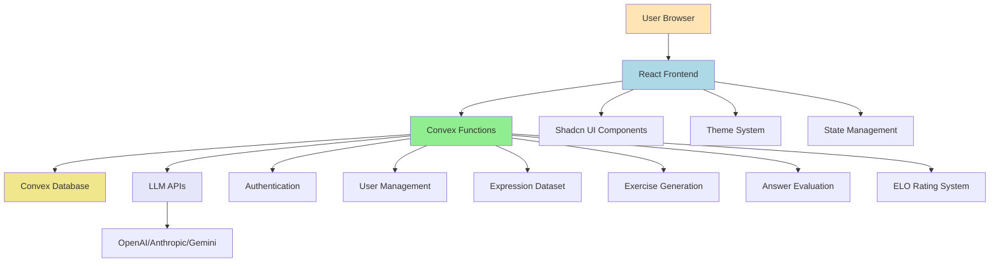

# German Language Learning MVP - Technical Architecture Document

## Introduction

This document outlines the complete technical architecture for the German Language Learning MVP, including backend systems, frontend implementation, and their integration. It serves as the single source of truth for AI-driven development, ensuring consistency across the entire technology stack.

The architecture is designed to support a minimal web application focused on high-quality German expression practice through a curated dataset of useful expressions, comprehensive usage examples, and diverse exercise types, all powered by LLMs for content generation and evaluation.

### Change Log
| Date | Version | Description | Author |
|------|---------|-------------|---------|
| $(date) | 1.0 | Initial architecture document | BMad Orchestrator |

---

## High Level Architecture

### Technical Summary

The German Language Learning MVP follows a **serverless architecture** using **Convex** as the unified backend platform, with a **React + TypeScript** frontend built with **Vite** and **Shadcn UI**. The system leverages **LLM APIs** for content generation and evaluation, implementing an **advanced ELO rating system** for adaptive difficulty. The architecture prioritizes **ultra-compact UI design** with sharp edges and colorful accents, while maintaining **sub-2-second response times** for AI evaluation.

### Platform and Infrastructure Choice

**Platform:** Convex (Unified Backend Platform)
**Key Services:** 
- Convex Database (built-in)
- Convex Functions (serverless)
- Convex Authentication
- Convex Real-time capabilities
- Convex Hosting and Deployment

**Deployment Host and Regions:** Convex Cloud (global distribution)

**Rationale:** Convex provides the perfect unified platform for this MVP, offering:
- Built-in authentication and database
- Serverless functions for API-like architecture
- Real-time capabilities for immediate feedback
- Global deployment with edge functions
- TypeScript-first development experience
- Cost-effective scaling for LLM integration

### Repository Structure

**Structure:** Monorepo with single Convex app
**Package Organization:** 
```
phraser/
├── convex/                 # Convex backend functions and schema
│   ├── schema.ts          # Database schema definitions
│   ├── auth.config.ts     # Authentication configuration
│   ├── functions/         # API-like functions
│   │   ├── users.ts       # User management functions
│   │   ├── expressions.ts # Expression dataset functions
│   │   ├── exercises.ts   # Exercise generation and delivery
│   │   ├── evaluation.ts  # AI-powered answer evaluation
│   │   └── elo.ts         # ELO rating system functions
│   └── types.ts           # Shared TypeScript types
├── src/                   # React frontend application
│   ├── components/        # Reusable UI components
│   ├── hooks/            # Custom React hooks
│   ├── lib/              # Utility functions and configurations
│   ├── pages/            # Application pages
│   └── styles/           # Global styles and theme
├── docs/                 # Project documentation
└── package.json          # Root package.json
```

### High Level Architecture Diagram



### Architectural Patterns

- **Serverless Architecture:** Convex functions for all backend operations - _Rationale:_ Scalability, cost-effectiveness, and simplified deployment
- **API-like Function Design:** Independent standalone functions for each action - _Rationale:_ Easy debugging, traceability, and maintenance
- **Component-Based UI:** Reusable React components with TypeScript - _Rationale:_ Maintainability and type safety across the application
- **Repository Pattern:** Abstract data access through Convex functions - _Rationale:_ Enables testing and future database migration flexibility
- **Event-Driven Updates:** Real-time UI updates through Convex subscriptions - _Rationale:_ Immediate feedback and responsive user experience

---

## Tech Stack

| Category | Technology | Version | Purpose | Rationale |
|----------|------------|---------|---------|------------|
| Frontend Language | TypeScript | 5.3.3 | Primary development language | Strong typing, excellent tooling, team expertise |
| Frontend Framework | React | 18.2.0 | UI framework | Component-based architecture, extensive ecosystem |
| Build Tool | Vite | 5.0.0 | Development and build tool | Fast development server, optimized builds |
| UI Component Library | Shadcn UI | Latest | Pre-built components | Consistent design system, customizable |
| CSS Framework | Tailwind CSS | 3.4.0 | Utility-first CSS | Rapid development, consistent styling |
| State Management | React Hooks + Convex | Latest | Client and server state | Built-in real-time state management |
| Backend Platform | Convex | Latest | Unified backend platform | Database, functions, auth, real-time in one |
| Database | Convex Database | Built-in | Data persistence | Automatic scaling, real-time subscriptions |
| Authentication | Convex Auth | Built-in | User management | Secure, built-in user system |
| API Style | Convex Functions | Latest | Backend API | Type-safe, serverless functions |
| LLM Integration | OpenAI/Anthropic | Latest | Content generation and evaluation | High-quality AI capabilities |
| Testing Framework | Vitest | Latest | Unit testing | Fast, Vite-native testing |
| E2E Testing | Playwright | Latest | End-to-end testing | Cross-browser testing |
| Code Quality | ESLint + Prettier | Latest | Code formatting | Consistent code style |
| Deployment | Convex Cloud | Latest | Hosting and deployment | Global edge deployment |

---

## Data Models

### User Model

**Purpose:** Represents authenticated users and their learning progress

**Key Attributes:**
- `_id`: Unique user identifier (Convex-generated)
- `email`: User's email address (unique)
- `name`: User's display name
- `currentLevel`: Current ELO rating (starts at 1000)
- `totalExercises`: Number of exercises completed
- `averageScore`: Average score across all exercises
- `lastActive`: Timestamp of last activity
- `preferences`: User preferences (theme, etc.)
- `createdAt`: Account creation timestamp

**Relationships:**
- One-to-many with ExerciseAttempts
- One-to-many with UserProgress

### Expression Model

**Purpose:** Represents German expressions in the curated dataset (global content)

**Key Attributes:**
- `_id`: Unique expression identifier
- `text`: The German expression text
- `translation`: English translation
- `difficulty`: ELO rating of the expression (B1-C2 levels)
- `category`: Expression category (formal, informal, business, etc.)
- `usageExamples`: Array of 5 usage examples
- `tags`: Array of relevant tags
- `createdAt`: Creation timestamp
- `lastUpdated`: Last modification timestamp

**Relationships:**
- One-to-many with Exercises
- Many-to-many with Users (through UserProgress)

### Exercise Model

**Purpose:** Represents individual translation exercises (global content)

**Key Attributes:**
- `_id`: Unique exercise identifier
- `expressionId`: Reference to parent expression
- `type`: Exercise type (translation, contextual, completion)
- `question`: The exercise question/prompt
- `correctAnswer`: Expected correct answer
- `difficulty`: ELO rating of the exercise
- `hints`: Optional hints for the exercise
- `createdAt`: Creation timestamp
- `globalUsageCount`: Total number of times used across all users
- `globalAverageScore`: Average score across all users

**Relationships:**
- Many-to-one with Expression
- One-to-many with ExerciseAttempts

**Relationships:**
- Many-to-one with Expression
- One-to-many with ExerciseAttempts

### ExerciseAttempt Model

**Purpose:** Tracks individual user attempts at exercises (user-specific data)

**Key Attributes:**
- `_id`: Unique attempt identifier
- `userId`: Reference to user
- `exerciseId`: Reference to exercise
- `userAnswer`: User's submitted answer
- `aiScore`: AI evaluation score (0-1)
- `aiFeedback`: AI-generated feedback text
- `levelChange`: ELO rating change for user
- `timeSpent`: Time taken to answer (seconds)
- `createdAt`: Attempt timestamp

**Relationships:**
- Many-to-one with User
- Many-to-one with Exercise

### UserProgress Model

**Purpose:** Tracks user progress and mastery for specific expressions (user-specific data)

**Key Attributes:**
- `_id`: Unique progress record identifier
- `userId`: Reference to user
- `expressionId`: Reference to expression
- `masteryLevel`: Current mastery level (0-100)
- `attemptsCount`: Number of attempts on this expression
- `lastAttempted`: Last attempt timestamp
- `bestScore`: Best score achieved on this expression
- `averageScore`: Average score across attempts for this expression

**Relationships:**
- Many-to-one with User
- Many-to-one with Expression

---

## Database Schema

### Convex Schema Definition

```typescript
// convex/schema.ts
import { defineSchema, defineTable } from "convex/schema";
import { v } from "convex/values";

export default defineSchema({
  users: defineTable({
    email: v.string(),
    name: v.optional(v.string()),
    currentLevel: v.number(), // ELO rating, starts at 1000
    totalExercises: v.number(),
    averageScore: v.number(),
    lastActive: v.number(), // timestamp
    preferences: v.optional(v.object({
      theme: v.optional(v.string()),
      notifications: v.optional(v.boolean()),
    })),
    createdAt: v.number(),
  }).index("by_email", ["email"]),

  expressions: defineTable({
    text: v.string(),
    translation: v.string(),
    difficulty: v.number(), // ELO rating
    category: v.string(),
    usageExamples: v.array(v.string()),
    tags: v.array(v.string()),
    createdAt: v.number(),
    lastUpdated: v.number(),
  }).index("by_difficulty", ["difficulty"]),

  exercises: defineTable({
    expressionId: v.id("expressions"),
    type: v.string(), // "translation", "contextual", "completion"
    question: v.string(),
    correctAnswer: v.string(),
    difficulty: v.number(), // ELO rating
    hints: v.optional(v.array(v.string())),
    createdAt: v.number(),
    globalUsageCount: v.number(), // Total usage across all users
    globalAverageScore: v.number(), // Average score across all users
  }).index("by_expression", ["expressionId"]),

  exerciseAttempts: defineTable({
    userId: v.id("users"),
    exerciseId: v.id("exercises"),
    userAnswer: v.string(),
    aiScore: v.number(), // 0-1 scale
    aiFeedback: v.string(),
    levelChange: v.number(), // ELO change
    timeSpent: v.number(), // seconds
    createdAt: v.number(),
  }).index("by_user", ["userId"]),

  userProgress: defineTable({
    userId: v.id("users"),
    expressionId: v.id("expressions"),
    masteryLevel: v.number(), // 0-100
    attemptsCount: v.number(),
    lastAttempted: v.number(),
    bestScore: v.number(),
    averageScore: v.number(),
  }).index("by_user_expression", ["userId", "expressionId"]),
});
```

---

## API-like Function Architecture

### Core Functions

#### User Management Functions

```typescript
// convex/functions/users.ts
export const createUser = mutation({
  args: { email: v.string(), name: v.optional(v.string()) },
  handler: async (ctx, args) => {
    // Create new user with initial ELO rating
  }
});

export const getUser = query({
  args: { userId: v.id("users") },
  handler: async (ctx, args) => {
    // Get user data with current level
  }
});

export const updateUserLevel = mutation({
  args: { userId: v.id("users"), newLevel: v.number() },
  handler: async (ctx, args) => {
    // Update user's ELO rating
  }
});
```

#### Expression Dataset Functions

```typescript
// convex/functions/expressions.ts
export const getExpressions = query({
  args: { limit: v.optional(v.number()) },
  handler: async (ctx, args) => {
    // Get expressions with pagination
  }
});

export const generateExpressions = mutation({
  args: { count: v.number() },
  handler: async (ctx, args) => {
    // Generate new expressions using LLM
  }
});
```

#### Exercise Management Functions

```typescript
// convex/functions/exercises.ts
export const getNextExercise = query({
  args: { userId: v.id("users") },
  handler: async (ctx, args) => {
    // Select next exercise based on user level and history
    // Returns global exercise data + user-specific attempt history
  }
});

export const generateExercises = mutation({
  args: { expressionId: v.id("expressions"), count: v.number() },
  handler: async (ctx, args) => {
    // Generate exercises for an expression using LLM
    // Creates global exercise content independent of users
  }
});

export const updateExerciseStats = mutation({
  args: { exerciseId: v.id("exercises"), userScore: v.number() },
  handler: async (ctx, args) => {
    // Update global exercise statistics (usage count, average score)
    // Called after each user attempt
  }
});
```

#### Answer Evaluation Functions

```typescript
// convex/functions/evaluation.ts
export const evaluateAnswer = mutation({
  args: { 
    exerciseId: v.id("exercises"), 
    userAnswer: v.string(),
    userId: v.id("users")
  },
  handler: async (ctx, args) => {
    // Evaluate answer using LLM
    // Create user-specific ExerciseAttempt record
    // Update global exercise statistics
    // Update user ELO rating
  }
});
```

#### ELO Rating System Functions

```typescript
// convex/functions/elo.ts
export const calculateEloChange = query({
  args: { 
    userRating: v.number(), 
    exerciseRating: v.number(), 
    userScore: v.number() 
  },
  handler: async (ctx, args) => {
    // Calculate ELO rating changes
  }
});

export const updateRatings = mutation({
  args: { 
    userId: v.id("users"), 
    exerciseId: v.id("exercises"), 
    userScore: v.number() 
  },
  handler: async (ctx, args) => {
    // Update both user and exercise ratings
  }
});
```

---

## LLM Integration Strategy

### Provider Selection

**Primary Choice:** OpenAI GPT-4 for content generation, GPT-3.5-turbo for evaluation
**Fallback:** Anthropic Claude for evaluation if cost optimization needed
**Rationale:** GPT-4 provides highest quality for content generation, GPT-3.5-turbo is cost-effective for evaluation

### Integration Patterns

#### Content Generation (GPT-4)
```typescript
// convex/lib/llm.ts
export const generateExpression = async (prompt: string) => {
  const response = await openai.chat.completions.create({
    model: "gpt-4",
    messages: [
      { role: "system", content: "You are a German language expert..." },
      { role: "user", content: prompt }
    ],
    temperature: 0.7,
    max_tokens: 500
  });
  return response.choices[0].message.content;
};
```

#### Answer Evaluation (GPT-3.5-turbo)
```typescript
export const evaluateAnswer = async (
  question: string, 
  correctAnswer: string, 
  userAnswer: string
) => {
  const response = await openai.chat.completions.create({
    model: "gpt-3.5-turbo",
    messages: [
      { role: "system", content: "Evaluate German translation answers..." },
      { role: "user", content: `Question: ${question}\nCorrect: ${correctAnswer}\nUser: ${userAnswer}` }
    ],
    temperature: 0.3,
    max_tokens: 200
  });
  return parseEvaluation(response.choices[0].message.content);
};
```

### Cost Optimization Strategy

1. **Separate Models:** GPT-4 for generation (quality), GPT-3.5-turbo for evaluation (cost)
2. **Caching:** Cache generated content to avoid regeneration
3. **Batch Processing:** Generate multiple exercises in single API call
4. **Rate Limiting:** Implement intelligent rate limiting to stay within budget
5. **Fallback Strategy:** Switch to cheaper models if cost exceeds threshold

---

## Frontend Architecture

### Component Structure

```
src/
├── components/
│   ├── ui/                 # Shadcn UI components
│   ├── auth/              # Authentication components
│   ├── exercise/          # Exercise-related components
│   ├── progress/          # Progress tracking components
│   └── layout/            # Layout components
├── hooks/
│   ├── useAuth.ts         # Authentication hook
│   ├── useExercise.ts     # Exercise management hook
│   ├── useProgress.ts     # Progress tracking hook
│   └── useTheme.ts        # Theme management hook
├── lib/
│   ├── convex.ts          # Convex client configuration
│   ├── utils.ts           # Utility functions
│   └── constants.ts       # Application constants
└── pages/
    ├── AuthPage.tsx       # Login/signup page
    ├── PracticePage.tsx   # Main practice interface
    └── LoadingPage.tsx    # Loading states
```

### State Management

**Convex Real-time State:**
- User authentication state
- Current exercise data
- User progress and level
- Real-time updates for immediate feedback

**Local State (React Hooks):**
- UI state (loading, error states)
- Form data (answer input)
- Theme preferences
- Session-specific data

### Theme System

```typescript
// src/lib/theme.ts
export const theme = {
  light: {
    background: "#ffffff",
    foreground: "#000000",
    primary: "#3b82f6",
    secondary: "#64748b",
    accent: "#f59e0b",
    border: "#e2e8f0",
  },
  dark: {
    background: "#0f172a",
    foreground: "#f8fafc",
    primary: "#60a5fa",
    secondary: "#94a3b8",
    accent: "#fbbf24",
    border: "#334155",
  }
};
```

---

## Performance Considerations

### Optimization Strategies

1. **Convex Optimizations:**
   - Use indexes for frequent queries
   - Implement pagination for large datasets
   - Cache frequently accessed data
   - Optimize function execution time

2. **Frontend Optimizations:**
   - Lazy load components
   - Implement virtual scrolling for large lists
   - Optimize bundle size with tree shaking
   - Use React.memo for expensive components

3. **LLM Integration Optimizations:**
   - Implement request caching
   - Use streaming responses where possible
   - Batch API calls when feasible
   - Implement retry logic with exponential backoff

### Performance Targets

- **Page Load Time:** < 2 seconds
- **AI Evaluation Response:** < 2 seconds
- **Exercise Loading:** < 1 second
- **Theme Switching:** < 100ms
- **Real-time Updates:** < 500ms

---

## Security Considerations

### Authentication Security

1. **Convex Auth Integration:**
   - Use built-in Convex authentication
   - Implement proper session management
   - Secure password requirements
   - Email verification for new accounts

2. **API Security:**
   - Validate all function inputs
   - Implement rate limiting
   - Secure LLM API key storage
   - Input sanitization for user content

### Data Protection

1. **User Data:**
   - Encrypt sensitive user information
   - Implement data retention policies
   - Provide data export/deletion capabilities
   - GDPR compliance considerations

2. **Content Security:**
   - Validate generated content for inappropriate material
   - Implement content moderation
   - Secure storage of exercise data
   - Backup and recovery procedures

---

## Testing Strategy

### Testing Pyramid

1. **Unit Tests (70%):**
   - ELO algorithm functions
   - Utility functions
   - Component logic
   - Type validation

2. **Integration Tests (20%):**
   - Convex function integration
   - LLM API integration
   - Database operations
   - Authentication flows

3. **E2E Tests (10%):**
   - Complete user journeys
   - Cross-browser compatibility
   - Performance testing
   - Accessibility testing

### Testing Tools

- **Unit Testing:** Vitest for fast, Vite-native testing
- **Component Testing:** React Testing Library
- **E2E Testing:** Playwright for cross-browser testing
- **API Testing:** Convex function testing utilities
- **Performance Testing:** Lighthouse CI

---

## Deployment Strategy

### Development Environment

1. **Local Development:**
   - Convex dev environment
   - Vite dev server
   - Hot reload for both frontend and backend
   - Local database for testing

2. **Staging Environment:**
   - Convex staging deployment
   - Preview deployments for testing
   - Integration testing environment
   - Performance monitoring

### Production Deployment

1. **Convex Cloud:**
   - Automatic deployment from Git
   - Global edge distribution
   - Built-in monitoring and logging
   - Automatic scaling

2. **Monitoring and Alerting:**
   - Convex dashboard monitoring
   - Error tracking and alerting
   - Performance metrics
   - User analytics

---

## Implementation Roadmap

### Phase 1: Foundation (Week 1-2)
- [ ] Set up Convex project and authentication
- [ ] Create React + TypeScript + Vite project
- [ ] Implement basic UI with Shadcn UI
- [ ] Set up database schema
- [ ] Create basic user management functions

### Phase 2: Core Features (Week 3-4)
- [ ] Implement expression dataset structure
- [ ] Create exercise generation functions
- [ ] Build ELO rating system
- [ ] Implement answer evaluation with LLM
- [ ] Create exercise selection algorithm

### Phase 3: User Experience (Week 5-6)
- [ ] Build ultra-compact UI components
- [ ] Implement theme system
- [ ] Add progress tracking
- [ ] Create loading states and error handling
- [ ] Polish user interactions

### Phase 4: Testing and Polish (Week 7-8)
- [ ] Comprehensive testing suite
- [ ] Performance optimization
- [ ] Security audit
- [ ] Final UI polish
- [ ] Deployment preparation

---

## Risk Mitigation

### Technical Risks

1. **LLM API Reliability:**
   - Implement fallback providers
   - Cache responses to reduce API calls
   - Monitor API costs and usage

2. **Performance Issues:**
   - Implement comprehensive monitoring
   - Set up performance budgets
   - Plan for scaling strategies

3. **Data Quality:**
   - Implement content validation
   - Regular quality audits
   - User feedback mechanisms

### Business Risks

1. **User Adoption:**
   - Focus on core value proposition
   - Implement user feedback loops
   - Plan for iterative improvements

2. **Cost Management:**
   - Monitor LLM API costs
   - Implement cost optimization strategies
   - Set up budget alerts

---

*Document created by BMad Orchestrator*
*Date: $(date)*
*Version: 1.0* 