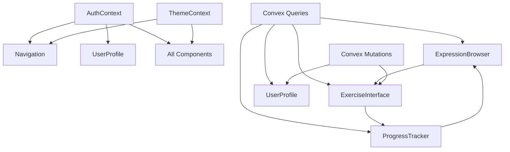

# Frontend Component Architecture

## Component Overview

This document defines the new React components required for the Phraser frontend enhancement, their responsibilities, integration points, and implementation guidelines.

## New Components

### Navigation Component

**File Location:** `src/components/Navigation.tsx`

**Responsibility:** Provide consistent navigation throughout the application with routing and user account controls

**Integration Points:**

- Integrates with existing `App.tsx`
- Uses `AuthContext` for user authentication state
- Uses `ThemeContext` for theme state
- TanStack Router for navigation

**Key Interfaces:**

```typescript
// Props
interface NavigationProps {
  user: User | null;
  currentPath: string;
}

// Hooks
const { user, logout } = useAuth();
const { theme, toggleTheme } = useTheme();
const navigate = useNavigate();
```

**Features:**

- Top navigation bar with main sections
- User account controls (profile, logout)
- Theme toggle
- Mobile-responsive menu
- Breadcrumb navigation

**Design Requirements:**

- Follow existing Tailwind CSS patterns
- Support dark/light theme
- Mobile-first responsive design
- Accessible navigation

### Expression Browser Component

**File Location:** `src/components/ExpressionBrowser.tsx`

**Responsibility:** Browse, search, and filter German expressions with pagination and detail views

**Integration Points:**

- Queries existing `expressions` table via Convex
- Integrates with `ExerciseInterface` for practice
- Uses existing user progress data

**Key Interfaces:**

```typescript
// Convex Queries
const expressions = useQuery(api.expressions.getExpressions, {
  category,
  difficulty,
  limit: 20,
});
const categories = useQuery(api.expressions.getCategories);
const userProgress = useQuery(api.progress.getAllUserProgress, { userId });

// State Management
const [filters, setFilters] = useState<ExpressionFilters>({});
const [pagination, setPagination] = useState<PaginationState>({});
const [selectedExpression, setSelectedExpression] = useState<Expression | null>(
  null,
);
```

**Features:**

- Expression list with pagination
- Search and filtering by category/difficulty
- Expression detail view
- Quick practice buttons
- Progress indicators per expression

**Design Requirements:**

- Card-based layout for expressions
- Clear difficulty indicators
- Responsive grid/list views
- Loading states and error handling

### Exercise Interface Component

**File Location:** `src/components/ExerciseInterface.tsx`

**Responsibility:** Provide interactive exercise practice with AI scoring and immediate feedback

**Integration Points:**

- Uses existing `exercises` table
- Updates `exerciseAttempts` table
- Integrates with `ProgressTracker` for real-time updates

**Key Interfaces:**

```typescript
// Convex Functions
const exercises = useQuery(api.exercises.getExercisesForExpression, {
  expressionId,
});
const submitAttempt = useMutation(api.exercises.submitExerciseAttempt);
const userProgress = useQuery(api.progress.getUserProgress, {
  userId,
  expressionId,
});

// State Management
const [currentExercise, setCurrentExercise] = useState<Exercise | null>(null);
const [userAnswer, setUserAnswer] = useState<string>("");
const [isSubmitting, setIsSubmitting] = useState<boolean>(false);
const [feedback, setFeedback] = useState<ExerciseFeedback | null>(null);
```

**Features:**

- Multiple exercise types (translation, completion, contextual)
- Real-time answer validation
- AI-powered scoring and feedback
- Progress tracking
- Exercise navigation

**Design Requirements:**

- Clean, focused interface
- Clear question presentation
- Immediate feedback states
- Accessible form controls

### Progress Tracker Component

**File Location:** `src/components/ProgressTracker.tsx`

**Responsibility:** Display comprehensive progress statistics, learning history, and performance analytics

**Integration Points:**

- Aggregates data from `userProgress`, `exerciseAttempts`, and `expressions` tables
- Uses existing user authentication
- Integrates with exercise interface for real-time updates

**Key Interfaces:**

```typescript
// Convex Queries
const allProgress = useQuery(api.progress.getAllUserProgress, { userId });
const userAttempts = useQuery(api.exercises.getUserAttempts, { userId });
const expressions = useQuery(api.expressions.getExpressions);

// State Management
const [selectedTimeframe, setSelectedTimeframe] = useState<Timeframe>("week");
const [selectedCategory, setSelectedCategory] = useState<string | null>(null);
```

**Features:**

- Progress overview with key metrics
- Learning history timeline
- Performance analytics charts
- Mastery level tracking
- Achievement badges

**Design Requirements:**

- Chart-based visualizations
- Interactive drill-down capabilities
- Responsive layout
- Clear data presentation

### User Profile Component

**File Location:** `src/components/UserProfile.tsx`

**Responsibility:** Manage user profile information, preferences, and account settings

**Integration Points:**

- Extends existing user data from `AuthContext`
- Integrates with existing auth functions
- Uses existing user preferences

**Key Interfaces:**

```typescript
// Auth Context
const { user, updateUser } = useAuth();

// Convex Functions
const updateProfile = useMutation(api.auth.updateUserProfile);
const getUserDetails = useQuery(api.auth.getUserById, { userId: user?._id });

// State Management
const [isEditing, setIsEditing] = useState<boolean>(false);
const [formData, setFormData] = useState<UserProfileForm>({});
```

**Features:**

- Profile information editing
- Preference management
- Account settings
- Learning preferences
- Data export/import

**Design Requirements:**

- Form-based interface
- Validation and error handling
- Secure data handling
- Responsive design

## Component Integration Patterns

### Data Flow Architecture



### State Management Strategy

**Global State (Context):**

- `AuthContext` - User authentication and session management
- `ThemeContext` - Dark/light theme preferences

**Local State (useState):**

- Component-specific state (filters, pagination, form data)
- UI interaction state (loading, error, success states)

**Server State (Convex Hooks):**

- `useQuery` - Data fetching and caching
- `useMutation` - Data updates and mutations

### Component Communication

**Parent-Child Communication:**

- Props for data passing
- Callback functions for events
- Context for shared state

**Cross-Component Communication:**

- Convex queries for shared data
- Context for global state
- URL parameters for deep linking

## Implementation Guidelines

### Component Standards

**TypeScript:**

- Strict type definitions for all props and state
- Interface definitions for all data structures
- Proper error handling with typed errors

**React Patterns:**

- Functional components with hooks
- Custom hooks for reusable logic
- Proper prop drilling avoidance

**Styling:**

- Tailwind CSS utility classes
- Consistent spacing and typography
- Dark/light theme support
- Responsive design principles

### Error Handling

**Component-Level:**

- Error boundaries for component crashes
- Loading states for async operations
- Validation for user inputs
- Graceful degradation for failures

**Data-Level:**

- Convex error handling patterns
- Network error recovery
- Data validation and sanitization
- Fallback states for missing data

### Performance Optimization

**Code Splitting:**

- Lazy loading for heavy components
- Route-based code splitting
- Component-level optimization

**Data Optimization:**

- Efficient Convex queries
- Proper caching strategies
- Pagination for large datasets
- Optimistic updates

### Accessibility

**WCAG Compliance:**

- Proper ARIA labels
- Keyboard navigation support
- Screen reader compatibility
- Color contrast requirements

**Mobile Accessibility:**

- Touch target sizing
- Gesture support
- Responsive design
- Performance optimization

## Testing Strategy

### Unit Testing

- Component rendering tests
- Hook testing
- Utility function testing
- Error handling tests

### Integration Testing

- Component interaction tests
- Convex function integration
- User flow testing
- Cross-component communication

### E2E Testing

- Complete user journeys
- Cross-browser compatibility
- Mobile responsiveness
- Performance testing

## Development Phases

### Phase 1: Foundation Components

1. Navigation component
2. Basic routing setup
3. Convex function stubs

### Phase 2: Core Components

1. Expression browser
2. Exercise interface
3. Basic progress tracking

### Phase 3: Advanced Components

1. Progress analytics
2. User profile management
3. Advanced features

### Phase 4: Polish and Optimization

1. Performance optimization
2. Accessibility improvements
3. Testing and bug fixes
