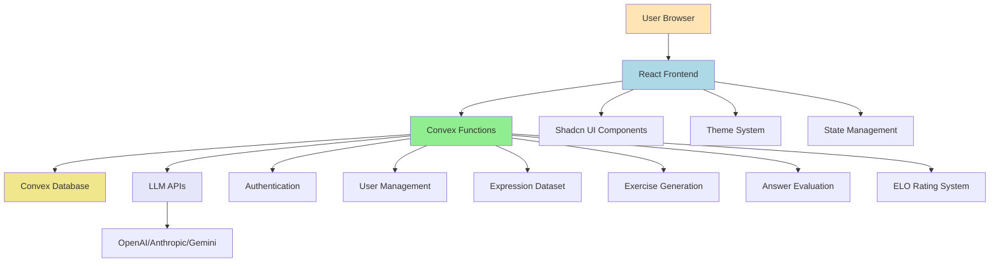

# High Level Architecture

## Technical Summary

The German Language Learning MVP follows a **serverless architecture** using **Convex** as the unified backend platform, with a **React + TypeScript** frontend built with **Vite** and **Shadcn UI**. The system leverages **LLM APIs** for content generation and evaluation, implementing an **advanced ELO rating system** for adaptive difficulty. The architecture prioritizes **ultra-compact UI design** with sharp edges and colorful accents, while maintaining **sub-2-second response times** for AI evaluation.

## Platform and Infrastructure Choice

**Platform:** Convex (Unified Backend Platform)
**Key Services:** 
- Convex Database (built-in)
- Convex Functions (serverless)
- Convex Authentication
- Convex Real-time capabilities
- Convex Hosting and Deployment

**Deployment Host and Regions:** Convex Cloud (global distribution)

**Rationale:** Convex provides the perfect unified platform for this MVP, offering:
- Built-in authentication and database
- Serverless functions for API-like architecture
- Real-time capabilities for immediate feedback
- Global deployment with edge functions
- TypeScript-first development experience
- Cost-effective scaling for LLM integration

## Repository Structure

**Structure:** Monorepo with single Convex app
**Package Organization:** 
```
phraser/
├── convex/                 # Convex backend functions and schema
│   ├── schema.ts          # Database schema definitions
│   ├── auth.config.ts     # Authentication configuration
│   ├── functions/         # API-like functions
│   │   ├── users.ts       # User management functions
│   │   ├── expressions.ts # Expression dataset functions
│   │   ├── exercises.ts   # Exercise generation and delivery
│   │   ├── evaluation.ts  # AI-powered answer evaluation
│   │   └── elo.ts         # ELO rating system functions
│   └── types.ts           # Shared TypeScript types
├── src/                   # React frontend application
│   ├── components/        # Reusable UI components
│   ├── hooks/            # Custom React hooks
│   ├── lib/              # Utility functions and configurations
│   ├── pages/            # Application pages
│   └── styles/           # Global styles and theme
├── docs/                 # Project documentation
└── package.json          # Root package.json
```

## High Level Architecture Diagram



## Architectural Patterns

- **Serverless Architecture:** Convex functions for all backend operations - _Rationale:_ Scalability, cost-effectiveness, and simplified deployment
- **API-like Function Design:** Independent standalone functions for each action - _Rationale:_ Easy debugging, traceability, and maintenance
- **Component-Based UI:** Reusable React components with TypeScript - _Rationale:_ Maintainability and type safety across the application
- **Repository Pattern:** Abstract data access through Convex functions - _Rationale:_ Enables testing and future database migration flexibility
- **Event-Driven Updates:** Real-time UI updates through Convex subscriptions - _Rationale:_ Immediate feedback and responsive user experience

---
