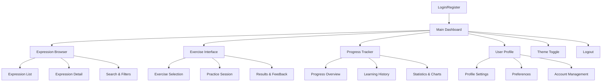
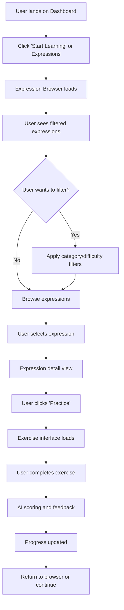
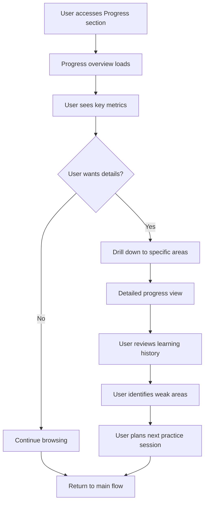
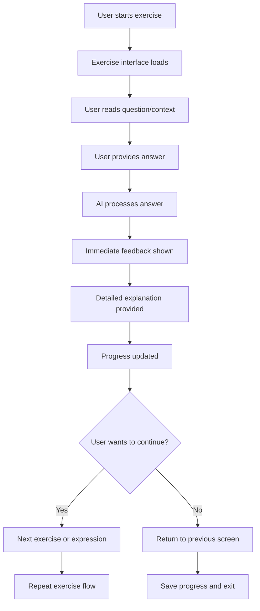

# **Phraser Language Learning App - UI/UX Specification**

## **Introduction**

This document defines the user experience goals, information architecture, user flows, and visual design specifications for Phraser's user interface. It serves as the foundation for visual design and frontend development, ensuring a cohesive and user-centered experience.

## **Overall UX Goals & Principles**

### **Target User Personas**

**Language Learner (Primary)**: German language students of all levels who want to practice expressions and track their progress. They value clear feedback, engaging exercises, and visible progress indicators.

**Casual Learner (Secondary)**: Users who practice occasionally and prefer simple, intuitive interfaces with minimal cognitive load. They need clear navigation and quick access to practice sessions.

**Progress-Focused Learner (Tertiary)**: Users who are motivated by detailed statistics, mastery levels, and learning analytics. They want comprehensive tracking and achievement systems.

### **Usability Goals**

- **Ease of learning**: New users can start practicing within 2 minutes of first login
- **Efficiency of use**: Regular users can complete a full practice session in under 10 minutes
- **Error prevention**: Clear validation and helpful feedback for all user inputs
- **Memorability**: Infrequent users can return and immediately understand their progress
- **Engagement**: Users feel motivated to continue learning through positive reinforcement

### **Design Principles**

1. **Clarity over cleverness** - Prioritize clear communication over aesthetic innovation
2. **Progressive disclosure** - Show only what's needed, when it's needed
3. **Consistent patterns** - Use familiar UI patterns throughout the application
4. **Immediate feedback** - Every action should have a clear, immediate response
5. **Accessible by default** - Design for all users from the start

### **Change Log**

| Date       | Version | Description                 | Author            |
| ---------- | ------- | --------------------------- | ----------------- |
| 2024-12-19 | 1.0     | Initial UI/UX specification | BMad Orchestrator |

## **Information Architecture (IA)**

### **Site Map / Screen Inventory**

### **Navigation Structure**

**Primary Navigation:** Top navigation bar with main sections (Dashboard, Expressions, Exercises, Progress, Profile) and user account controls

**Secondary Navigation:** Breadcrumbs for deep navigation and contextual actions within each section

**Breadcrumb Strategy:** Show current location and provide quick navigation back to parent sections

## **User Flows**

### **Flow 1: Expression Browsing and Practice**

**User Goal:** Find and practice German expressions at appropriate difficulty level

**Entry Points:** Dashboard "Start Learning" button, Expression Browser navigation

**Success Criteria:** User finds relevant expressions and can start practicing immediately

**Edge Cases & Error Handling:**

- No expressions available for selected filters
- Network errors during loading
- User session expires during practice
- Exercise fails to load or score

**Notes:** Filtering should be intuitive with clear visual feedback. Practice flow should be seamless with minimal friction.

### **Flow 2: Progress Tracking and Analytics**

**User Goal:** View learning progress and understand improvement areas

**Entry Points:** Dashboard progress cards, Progress navigation, Exercise completion

**Success Criteria:** User gains insights into their learning journey and feels motivated

**Edge Cases & Error Handling:**

- No progress data available
- Incomplete data for new users
- Performance issues with large datasets
- Privacy concerns with progress data

**Notes:** Progress should be visually engaging with charts and clear metrics. Focus on positive reinforcement and achievable goals.

### **Flow 3: Exercise Practice and Feedback**

**User Goal:** Complete exercises and receive helpful feedback to improve

**Entry Points:** Expression detail view, Dashboard quick practice, Progress recommendations

**Success Criteria:** User completes exercise with clear understanding of performance

**Edge Cases & Error Handling:**

- AI scoring fails or is unavailable
- User provides invalid input
- Exercise times out
- Network connectivity issues

**Notes:** Feedback should be immediate and constructive. AI scoring should feel fair and educational.

## **Wireframes & Mockups**

### **Design Files**

**Primary Design Files:** Figma design system and component library (to be created)

### **Key Screen Layouts**

#### **Dashboard Screen**

**Purpose:** Main landing page showing user progress and quick access to features

**Key Elements:**

- User welcome message and current level
- Progress summary cards (level, exercises, score)
- Quick action buttons (Start Learning, Continue Practice)
- Recent activity feed
- Navigation menu

**Interaction Notes:** Cards should be clickable for detailed views. Quick actions should be prominent and accessible.

**Design File Reference:** Dashboard wireframe and mockup

#### **Expression Browser Screen**

**Purpose:** Browse and search German expressions with filtering options

**Key Elements:**

- Search bar with autocomplete
- Filter controls (category, difficulty, tags)
- Expression cards with preview information
- Pagination controls
- Sort options

**Interaction Notes:** Filters should update results in real-time. Cards should show difficulty indicators and quick practice buttons.

**Design File Reference:** Expression browser wireframe and mockup

#### **Exercise Interface Screen**

**Purpose:** Interactive exercise practice with immediate feedback

**Key Elements:**

- Exercise question/context display
- Answer input area (multiple choice, text input, etc.)
- Timer (optional)
- Submit button
- Progress indicator

**Interaction Notes:** Input should be responsive and accessible. Submit should be clearly indicated.

**Design File Reference:** Exercise interface wireframe and mockup

#### **Progress Tracker Screen**

**Purpose:** Comprehensive view of learning progress and statistics

**Key Elements:**

- Progress overview charts
- Learning history timeline
- Mastery level indicators
- Achievement badges
- Performance analytics

**Interaction Notes:** Charts should be interactive with drill-down capabilities. History should be filterable by date and type.

**Design File Reference:** Progress tracker wireframe and mockup

## **Component Library / Design System**

### **Design System Approach**

**Approach:** Extend existing Tailwind CSS patterns with custom components for language learning specific interactions

### **Core Components**

#### **Progress Card Component**

**Purpose:** Display user progress metrics in an engaging, visual format

**Variants:** Level card, exercise count card, score card, mastery card

**States:** Loading, error, empty, normal, highlighted

**Usage Guidelines:** Use for dashboard and progress sections. Maintain consistent color coding for different metrics.

#### **Expression Card Component**

**Purpose:** Display German expressions with metadata and quick actions

**Variants:** List view, grid view, detail view

**States:** Normal, selected, completed, in-progress

**Usage Guidelines:** Include difficulty indicator, category tag, and practice button. Show translation on hover or click.

#### **Exercise Interface Component**

**Purpose:** Provide interactive exercise practice with various question types

**Variants:** Multiple choice, fill-in-blank, translation, contextual

**States:** Loading, active, submitted, feedback, error

**Usage Guidelines:** Maintain consistent layout across exercise types. Provide clear success/error states.

#### **Navigation Component**

**Purpose:** Provide consistent navigation throughout the application

**Variants:** Top navigation, breadcrumbs, mobile menu

**States:** Normal, active, disabled, mobile expanded

**Usage Guidelines:** Use existing color scheme and typography. Ensure mobile responsiveness.

#### **Progress Chart Component**

**Purpose:** Visualize learning progress and statistics

**Variants:** Line chart, bar chart, pie chart, progress ring

**States:** Loading, empty, normal, interactive

**Usage Guidelines:** Use consistent color palette. Provide accessibility features for screen readers.

## **Branding & Style Guide**

### **Visual Identity**

**Brand Guidelines:** Extend existing Phraser brand with language learning focus

### **Color Palette**

| Color Type       | Hex Code | Usage                               |
| ---------------- | -------- | ----------------------------------- |
| Primary Blue     | #2563EB  | Buttons, links, primary actions     |
| Success Green    | #059669  | Progress indicators, success states |
| Warning Orange   | #D97706  | Difficulty indicators, warnings     |
| Error Red        | #DC2626  | Error states, destructive actions   |
| Neutral Gray     | #6B7280  | Text, borders, secondary elements   |
| Background Light | #FFFFFF  | Light theme backgrounds             |
| Background Dark  | #1F2937  | Dark theme backgrounds              |

### **Typography**

**Primary Font:** System fonts (Inter, -apple-system, BlinkMacSystemFont)
**Headings:** Font weights 600-700 for hierarchy
**Body Text:** Font weight 400 for readability
**Code/Technical:** Monospace font for expressions and examples

### **Spacing System**

**Base Unit:** 4px (0.25rem)
**Common Spacings:** 8px, 16px, 24px, 32px, 48px
**Container Padding:** 16px on mobile, 24px on desktop
**Component Spacing:** 8px between related elements, 16px between sections

### **Iconography**

**Icon Library:** Heroicons or similar for consistency
**Icon Sizes:** 16px, 20px, 24px for different contexts
**Icon Colors:** Inherit text color or use semantic colors

## **Accessibility Requirements**

### **WCAG Compliance**

- **Level:** AA compliance target
- **Keyboard Navigation:** Full keyboard accessibility
- **Screen Reader Support:** Proper ARIA labels and semantic HTML
- **Color Contrast:** Minimum 4.5:1 ratio for normal text
- **Focus Indicators:** Clear focus states for all interactive elements

### **Mobile Accessibility**

- **Touch Targets:** Minimum 44px for touch interactions
- **Gesture Support:** Swipe gestures for mobile navigation
- **Viewport:** Proper viewport meta tags and responsive design
- **Performance:** Fast loading times on mobile networks

## **Responsive Design Strategy**

### **Breakpoints**

- **Mobile:** 320px - 767px
- **Tablet:** 768px - 1023px
- **Desktop:** 1024px+

### **Layout Adaptations**

**Mobile:**

- Single column layouts
- Collapsible navigation
- Touch-optimized interactions
- Simplified progress views

**Tablet:**

- Two-column layouts where appropriate
- Enhanced navigation
- Larger touch targets
- Detailed progress views

**Desktop:**

- Multi-column layouts
- Full navigation visible
- Hover states and interactions
- Comprehensive analytics views

## **Performance Requirements**

### **Loading Times**

- **Initial Load:** Under 3 seconds on 3G connection
- **Navigation:** Under 1 second for page transitions
- **Exercise Loading:** Under 2 seconds for new exercises
- **Progress Updates:** Real-time updates without blocking UI

### **Optimization Strategies**

- **Code Splitting:** Lazy load non-critical components
- **Image Optimization:** Compress and optimize all images
- **Caching:** Implement proper caching strategies
- **Bundle Size:** Keep main bundle under 500KB

## **User Testing Plan**

### **Testing Phases**

**Phase 1: Wireframe Testing**

- Test information architecture and navigation
- Validate user flows and task completion
- Identify usability issues early

**Phase 2: Prototype Testing**

- Test interactive prototypes
- Validate exercise interface usability
- Test progress tracking comprehension

**Phase 3: Beta Testing**

- Test with real users
- Validate performance and accessibility
- Gather feedback for final iterations

### **Success Metrics**

- **Task Completion Rate:** 90%+ for core user flows
- **Time to Complete:** Under 5 minutes for first practice session
- **Error Rate:** Less than 5% for form submissions
- **User Satisfaction:** 4.0+ rating on usability scale

## **Implementation Guidelines**

### **Development Priorities**

1. **Core Navigation** - Establish app structure and routing
2. **Expression Browser** - Enable expression discovery and filtering
3. **Exercise Interface** - Build core practice functionality
4. **Progress Tracking** - Implement analytics and feedback
5. **Polish & Optimization** - Performance and accessibility improvements

### **Quality Assurance**

- **Design Reviews:** Regular reviews of implemented components
- **Accessibility Audits:** Automated and manual testing
- **Performance Monitoring:** Continuous performance tracking
- **User Feedback:** Regular collection and incorporation of user input

### **Documentation Requirements**

- **Component Documentation:** Storybook or similar for component library
- **Design Tokens:** Maintained design system with tokens
- **User Guides:** In-app help and onboarding materials
- **Developer Documentation:** Technical implementation guides
