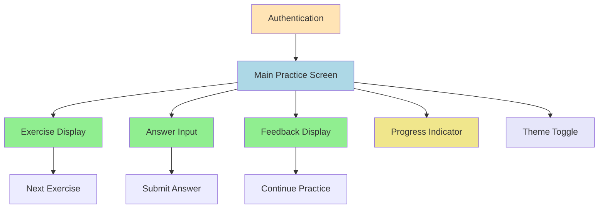
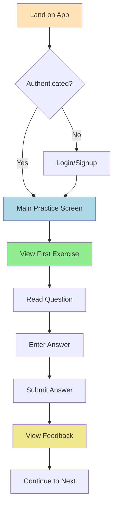
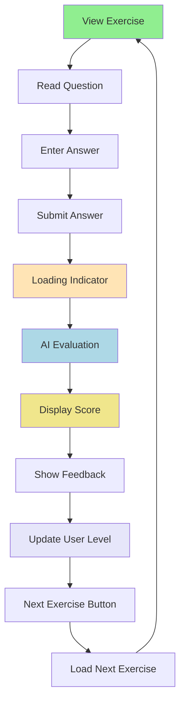
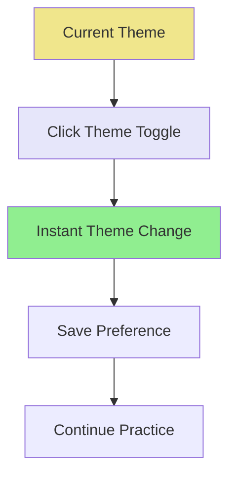

# German Language Learning MVP - UI/UX Specification

## Introduction

This document defines the user experience goals, information architecture, user flows, and visual design specifications for the German Language Learning MVP's user interface. It serves as the foundation for visual design and frontend development, ensuring a cohesive and user-centered experience focused on ultra-compact, distraction-free learning.

---

## Overall UX Goals & Principles

### Target User Personas

**Primary User: Intermediate to Advanced German Learner (B2/C1)**
- **Demographics:** 25-45 years old, college-educated professionals
- **Current State:** Already proficient in basic German grammar and vocabulary
- **Goals:** Improve fluency, master nuanced expressions, achieve C1/C2 level
- **Pain Points:** Lack of effective tools for advanced expression practice
- **Behavior:** Values efficiency, uses multiple learning resources, seeks targeted practice

**Secondary User: Serious Language Learner**
- **Characteristics:** Dedicated to language mastery, values quality over quantity
- **Needs:** Comprehensive feedback, progress tracking, adaptive difficulty
- **Motivation:** Professional or academic advancement in German

### Usability Goals

1. **Ease of Learning:** New users can start practicing within 2 minutes of first visit
2. **Efficiency of Use:** Users can complete exercises with minimal cognitive load
3. **Error Prevention:** Clear feedback prevents confusion about exercise expectations
4. **Memorability:** Interface is so simple users can return without relearning
5. **Distraction-Free:** UI elements support focus on language practice only
6. **Adaptive Experience:** Interface adapts to user's current level and progress

### Design Principles

1. **Ultra-Compact Efficiency** - Maximize content visibility, minimize UI bloat
2. **Sharp, Crisp Aesthetics** - No rounded borders, clean geometric design
3. **Colorful Visual Hierarchy** - Strategic use of color to guide attention
4. **Immediate Feedback** - Every action has clear, instant response
5. **Progressive Disclosure** - Show only essential information at each step
6. **Accessible by Default** - Design for all users from the start

### Change Log
| Date | Version | Description | Author |
|------|---------|-------------|---------|
| $(date) | 1.0 | Initial UI/UX specification | UX Expert Agent |

---

## Information Architecture (IA)

### Site Map / Screen Inventory

### Navigation Structure

**Primary Navigation:** Single-screen application with minimal navigation
- Main practice screen serves as the central hub
- No traditional navigation menu required
- "Next Exercise" button provides primary navigation

**Secondary Navigation:** Corner-based controls
- Theme toggle in top-right corner
- Progress indicator in top-left corner
- No secondary navigation menus

**Breadcrumb Strategy:** Not applicable - single-screen focused experience

---

## User Flows

### Flow 1: Initial User Onboarding

**User Goal:** Start practicing German expressions immediately
**Entry Points:** Direct URL access, authentication completion
**Success Criteria:** User can complete first exercise within 2 minutes

**Edge Cases & Error Handling:**
- Network failure during authentication
- Invalid credentials with clear error messages
- Loading states for all async operations
- Graceful handling of empty exercise queue

**Notes:** Focus on speed and simplicity - minimize friction to first exercise

### Flow 2: Exercise Practice Session

**User Goal:** Practice German expressions with immediate feedback
**Entry Points:** Main practice screen, "Next Exercise" button
**Success Criteria:** User receives appropriate challenge and helpful feedback

**Edge Cases & Error Handling:**
- AI evaluation timeout with retry option
- Invalid answer format with helpful guidance
- Network errors with offline indicators
- Empty answer submission prevention

**Notes:** Maintain focus during evaluation - loading states should be engaging but not distracting

### Flow 3: Theme Switching

**User Goal:** Switch between dark and light themes
**Entry Points:** Corner theme toggle button
**Success Criteria:** Theme changes immediately and persists across sessions

**Edge Cases & Error Handling:**
- Theme preference save failure
- Incomplete theme loading
- Browser compatibility issues

**Notes:** Theme change should be instant and smooth, no page reload required

---

## Wireframes & Mockups

### Design Files
**Primary Design Files:** Figma (recommended) or Sketch for detailed mockups
**Wireframe Tool:** Miro or FigJam for collaborative wireframing

### Key Screen Layouts

#### Screen 1: Authentication Screen
**Purpose:** Simple, secure user authentication
**Key Elements:**
- Minimal login form with email/password
- Sharp, geometric input fields
- Colorful accent for primary action button
- Ultra-compact layout with minimal padding
- Clear error messaging for invalid credentials

**Interaction Notes:** Form validation with immediate feedback, loading states for submission
**Design File Reference:** `auth-screen.fig`

#### Screen 2: Main Practice Screen
**Purpose:** Central hub for all learning activities
**Key Elements:**
- Large, prominent exercise question display
- Clean answer input field with sharp borders
- Colorful "Submit Answer" button
- Minimal progress indicator (current level only)
- Corner theme toggle with icon
- "Next Exercise" button for navigation

**Interaction Notes:** Single exercise focus, immediate feedback display, smooth transitions
**Design File Reference:** `main-practice-screen.fig`

#### Screen 3: Feedback Display
**Purpose:** Show AI evaluation results and guidance
**Key Elements:**
- Prominent score display (0-1 scale)
- Detailed feedback text with corrections
- Color-coded score indicators
- "Continue" button to next exercise
- Loading animation during AI evaluation

**Interaction Notes:** Feedback appears immediately after submission, clear next steps
**Design File Reference:** `feedback-display.fig`

---

## Component Library / Design System

### Design System Approach
**Shadcn UI Base:** Leverage Shadcn UI components with custom theme overrides
**Custom Components:** Build specialized components for exercise display and feedback
**Theme System:** Dark/light mode with consistent design tokens

### Core Components

#### Component 1: Exercise Card
**Purpose:** Display individual exercise questions and collect answers
**Variants:** Translation exercise, contextual exercise, sentence completion
**States:** Default, focused, loading, error, completed
**Usage Guidelines:** Always full-width, minimal padding, sharp edges

#### Component 2: Answer Input
**Purpose:** Collect user responses with validation
**Variants:** Text input, textarea for longer answers
**States:** Empty, typing, valid, invalid, submitting
**Usage Guidelines:** Clear placeholder text, immediate validation feedback

#### Component 3: Feedback Display
**Purpose:** Show AI evaluation results and guidance
**Variants:** Success, partial success, needs improvement
**States:** Loading, complete, error
**Usage Guidelines:** Color-coded by performance level, actionable feedback

#### Component 4: Progress Indicator
**Purpose:** Show current user level and practice status
**Variants:** Numeric level, progress bar, achievement badges
**States:** Current level, level change animation
**Usage Guidelines:** Minimal display, prominent but not distracting

#### Component 5: Theme Toggle
**Purpose:** Switch between dark and light themes
**Variants:** Icon button, text button
**States:** Light mode, dark mode, transitioning
**Usage Guidelines:** Corner placement, instant feedback, persistent preference

---

## Branding & Style Guide

### Visual Identity
**Brand Guidelines:** Minimalist, education-focused design
**Design Philosophy:** Sharp, geometric, colorful accents, ultra-compact

### Color Palette

| Color Type | Hex Code | Usage |
|------------|----------|-------|
| Primary Blue | #2563EB | Primary actions, links |
| Success Green | #16A34A | Positive feedback, correct answers |
| Warning Orange | #EA580C | Partial success, attention needed |
| Error Red | #DC2626 | Errors, incorrect answers |
| Neutral Gray | #6B7280 | Text, borders, backgrounds |
| Accent Purple | #7C3AED | Highlights, special elements |
| Background Light | #FFFFFF | Light theme background |
| Background Dark | #0F172A | Dark theme background |

### Typography

**Primary Font:** Inter (clean, readable, modern)
**Font Sizes:**
- Large Headings: 24px/1.5rem
- Body Text: 16px/1rem
- Small Text: 14px/0.875rem
- Exercise Text: 18px/1.125rem (larger for readability)

**Font Weights:**
- Regular: 400
- Medium: 500
- Semibold: 600
- Bold: 700

### Spacing System

**Ultra-Compact Spacing:**
- XS: 4px (0.25rem)
- S: 8px (0.5rem)
- M: 12px (0.75rem)
- L: 16px (1rem)
- XL: 24px (1.5rem)
- XXL: 32px (2rem)

**Usage Guidelines:**
- Minimal padding on containers (8px-12px)
- Tight spacing between related elements
- Generous spacing only for content separation

### Icon System

**Icon Library:** Lucide React (sharp, geometric icons)
**Icon Sizes:**
- Small: 16px
- Medium: 20px
- Large: 24px

**Icon Guidelines:**
- Sharp, geometric style
- Consistent stroke width
- Color inheritance from parent
- Tooltips for all icons

---

## Accessibility Requirements

### WCAG AA Compliance
- **Color Contrast:** Minimum 4.5:1 ratio for normal text
- **Keyboard Navigation:** Full keyboard accessibility
- **Screen Reader Support:** Proper ARIA labels and semantic HTML
- **Focus Management:** Clear focus indicators
- **Error Handling:** Clear error messages and recovery options

### Responsive Design
- **Breakpoints:** Mobile (320px), Tablet (768px), Desktop (1024px+)
- **Touch Targets:** Minimum 44px for mobile interactions
- **Text Scaling:** Support for browser text scaling
- **Orientation:** Portrait and landscape support

---

## Performance & Technical Considerations

### Loading States
- **Skeleton Screens:** For exercise loading
- **Progress Indicators:** For AI evaluation
- **Error States:** Clear messaging for failures
- **Offline Support:** Basic functionality without network

### Animation Guidelines
- **Duration:** 150ms for micro-interactions, 300ms for transitions
- **Easing:** Ease-out for natural feel
- **Performance:** 60fps animations, GPU acceleration
- **Reduced Motion:** Respect user preferences

### Browser Support
- **Modern Browsers:** Chrome 90+, Firefox 88+, Safari 14+, Edge 90+
- **Mobile Browsers:** iOS Safari 14+, Chrome Mobile 90+
- **Progressive Enhancement:** Core functionality works without JavaScript

---

## Next Steps

### Implementation Priority
1. **Core Components:** Exercise card, answer input, feedback display
2. **Theme System:** Dark/light mode implementation
3. **Responsive Design:** Mobile and tablet optimization
4. **Accessibility:** WCAG AA compliance
5. **Performance:** Loading states and error handling

### Design Handoff
- **Figma Files:** Detailed mockups for all screens
- **Component Specs:** Technical specifications for developers
- **Style Guide:** Complete design tokens and guidelines
- **Prototype:** Interactive prototype for user testing

---

*Document created by BMad Orchestrator using UX Expert Agent*
*Date: $(date)*
*Workflow: Greenfield Full-Stack Development* 